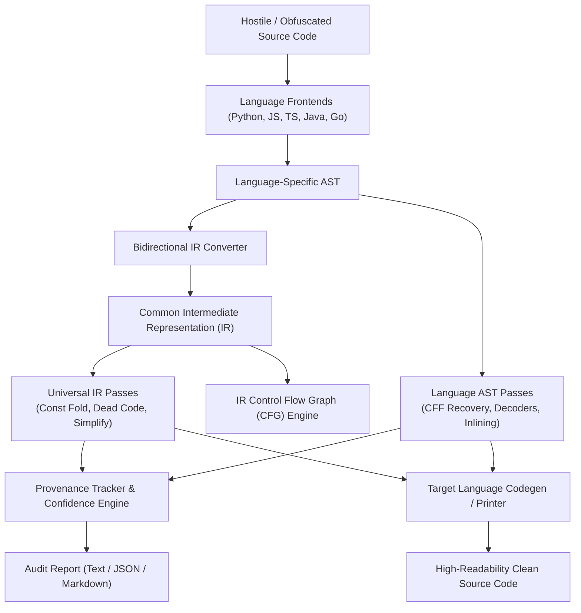

# Universal Deobfuscator Architecture

This document provides a comprehensive technical overview of the architecture, design principles, intermediate representation, analysis engines, and security model of the **Universal Deobfuscator**.

---

## 1. High-Level Architecture

The Universal Deobfuscator is structured as an **analysis and transformation framework** rather than a heuristic pattern-matcher. It follows a multi-tier compiler pipeline architecture:



The system operates across three core architectural tiers:
1. **Frontend Tier (Language Parsers & ASTs)**: Ingests raw source or bytecode, tracks source locations (line and column offsets), and produces validated AST representations.
2. **Analysis & Intermediate Representation Tier (Common IR & CFG)**: Normalizes language constructs into language-neutral IR instructions, builds directed control-flow graphs, performs reaching definition analysis, symbolic evaluation, and dead-block pruning.
3. **Synthesis & Provenance Tier (Codegen & Audit Engine)**: Emits canonical, idiomatic source code in the target language while maintaining a complete, verifiable audit trail of every transformation.

---

## 2. Supported Languages

| Language | Supported Extensions | Frontend Mechanism | AST Representation | Common IR Support | Codegen / Printer |
| :--- | :--- | :--- | :--- | :--- | :--- |
| **Python** | `.py`, `.pyw` | Python 3.11+ stdlib `ast` | Python standard AST | Full bidirectional | `ast.unparse` / custom formatter |
| **JavaScript** | `.js`, `.mjs`, `.cjs` | Pure stdlib recursive-descent parser | ESTree-compatible AST | Full bidirectional | `JSPrinter` |
| **TypeScript** | `.ts`, `.tsx`, `.mts`, `.cts` | Recursive-descent parser + type parser | ESTree AST with type extensions | Full bidirectional | `TSPrinter` (preserves TS or emits clean JS) |
| **Java** | `.java` | Pure stdlib recursive-descent parser | Java AST (classes, methods, control flow) | Full bidirectional | `JavaPrinter` |
| **Java Bytecode**| `.class`, `.jar` | Pure stdlib JVM class/JAR parser | Synthesized Java AST | Full bidirectional | `JavaPrinter` |
| **Go** | `.go` | Pure stdlib recursive-descent parser | Go AST (packages, funcs, channels, decls) | Full bidirectional | `GoPrinter` |

---

## 3. Common Intermediate Representation (IR)

The Common IR (`core/ir.py`) abstracts syntactical divergences between programming languages into high-level compiler primitives. This enables transformation passes to operate universally across all languages.

### Core IR Hierarchy
```text
IRNode
├── IRExpression
│   ├── IRConstant (Literal int, float, bool, None)
│   ├── IRString (String with encoding & raw metadata)
│   ├── IRVariable (Identifier reference with type hints)
│   ├── IRBinaryOperation (+, -, *, /, %, &, |, ^, <<, >>, and, or)
│   ├── IRUnaryOperation (-, ~, not)
│   ├── IRCall (Function / method invocation with args and kwargs)
│   ├── IRMemberAccess (obj.property or obj.field)
│   ├── IRIndexAccess (arr[index] or map[key])
│   ├── IRListLiteral ([elem1, elem2, ...])
│   └── IRDictLiteral ({k1: v1, k2: v2, ...})
└── IRStatement
    ├── IRAssignment (target = value)
    ├── IRBranch (if condition then body else orelse)
    ├── IRLoop (while condition or for loop with body)
    ├── IRReturn (return expression)
    ├── IRException (raise / throw expression)
    ├── IRTryCatch (try block, catch handlers, finally)
    ├── IRImport (module import with aliases)
    ├── IRBlock (grouped statements)
    ├── IRFunction (named routine with parameters and return type)
    └── IRModule (top-level compilation unit)
```

### Control Flow Graph (CFG) Engine (`core/ir_cfg.py`)
For any IR block or function, the CFG engine constructs a directed graph of `BasicBlock` instances:
- **Leader Detection**: Identifies block boundaries at function entry, branch targets, jump instructions, and statements immediately following branches.
- **Edge Categorization**:
  - `FALLTHROUGH`: Unconditional execution flow into the succeeding block.
  - `BRANCH_TRUE` / `BRANCH_FALSE`: Conditional branching based on truth evaluation.
  - `JUMP`: Unconditional jump (loop repeat, break, continue).
- **Graph Algorithms**:
  - Reachability Analysis: Identifies unreachable blocks starting from the entry block.
  - Cycle & Back-edge Detection: Detects loops and recursion cycles.
  - Predecessor / Successor Linking: Enables bi-directional data-flow traversals.
  - Dominator Tree: Computes immediate dominators for loop invariant and structure recovery.

---

## 4. Static Transformation Catalog

All transformations preserve runtime semantics and record provenance.

### 4.1 Constant Folding & Propagation
- Evaluates compile-time deterministic constant arithmetic (`10 + 20` $\rightarrow$ `30`).
- Evaluates bitwise identities (`x ^ x` $\rightarrow$ `0`, `x & 0` $\rightarrow$ `0`, `x | 0` $\rightarrow$ `x`).
- Tracks single-assignment variables across basic blocks and substitutes constant values into downstream uses.

### 4.2 Control-Flow Flattening (CFF) Recovery
- Deobfuscates dispatcher loops (state-machine obfuscation).
- Analyzes switch / if-chain dispatcher blocks controlled by a state variable.
- Traces symbolic state transitions across dispatch cycles.
- Reconstructs linear execution sequences and nested structured conditionals (`if`/`else`), removing state variables and dispatcher overhead.

### 4.3 Decoder Detection & Unmasking
- Identifies embedded obfuscation wrappers:
  - Base64 (`base64.b64decode`, `atob`, `btoa`)
  - Hexadecimal (`bytes.fromhex`, `binascii.unhexlify`, `\x..` escapes)
  - URL encoding (`urllib.parse.unquote`, `decodeURIComponent`)
  - Character code sequences (`chr(..)`, `ord(..)`, `String.fromCharCode`)
  - XOR masking (`key ^ cipher` loops and vector expressions)
  - Compression (`zlib.decompress`, `gzip.decompress`)
- Evaluates constant inputs compile-time and replaces the call with the plaintext literal.

### 4.4 Expression Folding & Algebraic Simplification
- Simplifies self-canceling operations (`~~x` $\rightarrow$ `x`, `--x` $\rightarrow$ `x`, `not not x` $\rightarrow$ `bool(x)`).
- Folds constant string concatenations (`"a" + "b" + "c"` $\rightarrow$ `"abc"`).
- Normalizes array join idioms (`['h','e','l','l','o'].join('')` $\rightarrow$ `'hello'`).
- Simplifies member property access (`window['document']` $\rightarrow$ `window.document`).

### 4.5 Dead Code Elimination
- Eliminates branches guarded by compile-time constant booleans (`if False: ...`).
- Prunes unreachable basic blocks identified by CFG reachability analysis.
- Removes unused variable assignments where the variable has no reaching uses and no side effects.

### 4.6 Function Inlining & IIFE Normalization
- Normalizes Immediately Invoked Function Expressions (`(function() { return 42; })()` $\rightarrow$ `42`).
- Inlines trivial single-return proxy functions used as indirection obfuscation.

---

## 5. Confidence & Provenance Engine

Every transformation performed by the Universal Deobfuscator is tracked with cryptographic precision.

### 5.1 Provenance Records (`core/provenance.py`)
Each modification creates a `ProvenanceRecord`:
```python
@dataclass
class ProvenanceRecord:
    pass_name: str          # Name of the executing pass
    original: str           # Source text before transformation
    transformed: str        # Resulting source text after transformation
    confidence: Confidence  # Quantitative & qualitative confidence rating
    location: SourceLocation# File, line number, and column offset
    timestamp: datetime     # Timestamp of transformation
```

### 5.2 Confidence Scoring (`core/confidence.py`)
Confidence is divided into discrete levels and categories:

- **Levels**:
  - `CERTAIN` (Score 1.0): Mathematically proven equivalence (e.g. constant arithmetic folding, static Base64 decode).
  - `HIGH` (Score 0.8): Structural analysis with verified invariants (e.g. dead branch elimination on constant condition).
  - `MEDIUM` (Score 0.5): Inferred semantics with potential edge-case dependency (e.g. function inlining).
  - `LOW` (Score 0.2): Heuristic approximation.
  - `UNKNOWN` (Score 0.0): Unresolved dynamic construct.

- **Categories**:
  - `RECOVERED`: Extracted hidden payload or unmasked structure.
  - `INFERRED`: Deduced data type, control flow, or constant state.
  - `SIMPLIFIED`: Folded expression or eliminated dead code.
  - `UNRESOLVED`: Obfuscation construct retained due to ambiguity.

---

## 6. Secure Dynamic Analysis Sandbox

When static analysis cannot resolve multi-stage packing or encrypted payloads, the tool provides an **opt-in secure dynamic analysis engine** (`dynamic/`).

### 6.1 Security Principles
1. **Never execute on the host process**: The analyzer process never imports, executes, or evals untrusted code.
2. **Subprocess isolation**: Analysis executes in a strictly bounded subprocess.
3. **Opt-in only**: Dynamic execution is disabled by default and requires the `--dynamic` CLI flag.
4. **Defense-in-depth resource limits**:
   - `RLIMIT_CPU`: Hard CPU time limit (default: 2.0 seconds).
   - `RLIMIT_AS`: Hard virtual address space memory ceiling (default: 64 MB).
   - `RLIMIT_FSIZE`: File creation capped at 0 bytes (no writes allowed).
   - `RLIMIT_NPROC`: Process fork creation capped at 0 child processes.
5. **Network and filesystem isolation**:
   - Execution occurs in an ephemeral temporary directory jail.
   - Network namespace unsharing (`CLONE_NEWNET`) or loopback null-routing prevents external connections.
6. **Execution Step Cap**:
   - A deterministic tracer (`dynamic/tracer.py`) limits execution to at most 10,000 instructions, terminating loops or recursion bombs.

---

## 7. Limitations & Rice's Theorem

> **Important Notice: The Universal Deobfuscator Never Claims 100% Deobfuscation.**

In accordance with Section 2 of the Master Specification:
- **Theoretical Limits**: By **Rice's Theorem** and the **Halting Problem**, any non-trivial semantic property of arbitrary programs is undecidable statically.
- **Opaque Predicates**: Obfuscation relying on undecidable number-theoretic conjectures (e.g. Collatz sequences) cannot be proven unconditionally dead without bounded execution.
- **Dynamic Reflection & Environment Keys**: Malware that decrypts payloads using environment variables, system hardware serials, or remote server responses cannot be statically deobfuscated without the key.
- **Design Philosophy**: The tool maximizes semantic recovery, readability, and analyst safety while clearly documenting unresolved constructs.
