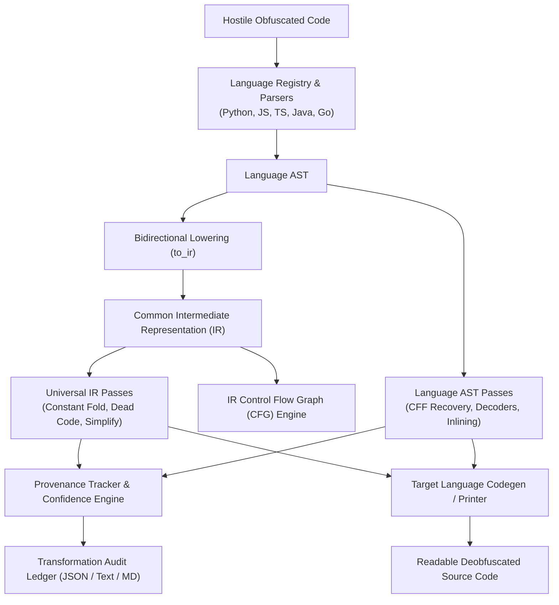

# UNMASK: Universal Code Deobfuscator & Reverse Engineering Engine

<p align="center">
  
  
  
  
  
</p>

```text
   01010100 01001000 01000101 00100000 01001101 01000001 01010100 01010010 01001001 01011000
  ┌───[ SYSTEM : UNMASK v1.0.0 ]───[ DEVELOPED BY : SAYANTAN ]───[ STATUS : ACTIVE ]─────────┐
  │ 01  10  00  11  01  10  00  11  01  10  00  11  01  10  00  11  01  10  00  11  01  10   │
  │  ██╗   ██╗███╗   ██╗███╗   ███╗ █████╗ ███████╗██╗  ██╗   01010100 01001000 01000101     │
  │  ██║   ██║████╗  ██║████╗ ████║██╔══██╗██╔════╝██║ ██╔╝   01001101 01000001 01010100     │
  │  ██║   ██║██╔██╗ ██║██╔████╔██║███████║███████╗█████╔╝    >> WAKE UP, OPERATOR...        │
  │  ██║   ██║██║╚██╗██║██║╚██╔╝██║██╔══██║╚════██║██╔═██╗    >> DEVELOPED BY SAYANTAN       │
  │  ╚██████╔╝██║ ╚████║██║ ╚═╝ ██║██║  ██║███████║██║  ██╗   01000100 01000101 01001111     │
  │   ╚═════╝ ╚═╝  ╚═══╝╚═╝     ╚═╝╚═╝  ╚═╝╚══════╝╚═╝  ╚═╝   01000010 01000110 00100001     │
  │ 10  01  11  00  10  01  11  00  10  01  11  00  10  01  11  00  10  01  11  00  10  01   │
  └───[ UNIVERSAL CODE REVERSE ENGINEERING & DEOBFUSCATION CONSTRUCT ]───────────────────────┘
  :: [DEVELOPER]  : Sayantan
  :: [TARGETS]    : Python 3.11+ │ JavaScript (ES2024) │ TypeScript │ Java & Bytecode │ Go
  :: [SUBSYSTEMS] : Control-Flow De-Flattening │ Opaque Branch Pruner │ Symbolic Algebra
  :: [DECODERS]   : Base64 │ Hex │ URL │ XOR Multi-Byte │ Zlib/Gzip │ Unicode Unpack
  :: [SANDBOX]    : Subprocess POSIX Jails │ CPU/Memory rlimits │ Step-Capped Tracing
  ----------------------------------------------------------------------------------------
```

---

## 🌟 Overview

**UNMASK** is a professional, multi-tier compiler and AST transformation framework designed to reverse complex, hostile code obfuscation patterns into clean, readable, semantically equivalent source code.

Developed by **Sayantan**, UNMASK is built with **zero third-party dependencies**—using strictly the modern Python 3.11+ standard library—and features:
* **Multi-Language AST Parsers:** Custom hand-rolled parsers for JavaScript, TypeScript, Java (source and JVM bytecode), and Go, plus standard Python AST.
* **Common Intermediate Representation (Common IR):** Language-agnostic compiler IR with bidirectional lowering (`to_ir`) and raising (`from_ir`).
* **Interactive Terminal Console:** Full interactive menu system guiding you step-by-step without having to memorize CLI flags.
* **Provenance Ledger & Confidence Scoring:** Tracks every individual code mutation with source locations, diffs, and quantitative confidence metrics.
* **POSIX Dynamic Execution Sandbox:** Isolated subprocess sandbox with strict resource limits (`rlimits`), memory fencing, and instruction-level execution tracing.

---

## 🖥️ Interactive Console Menu (No Options/Flags Needed!)

Launch UNMASK without flags to drop straight into the interactive control center:

```bash
./main.py
# Or with:
./main.py --menu
```

```text
[ CORE OPERATIONS ]
  [1] ⚡ Deobfuscate Payload      (Unpack, decode strings, simplify logic)
  [2] 🔍 Static Analysis          (Inspect obfuscation patterns & metrics)
  [3] ⚙️  Syntax & AST Dump        (Validate grammar, view AST / clean code)
  [4] 🔄 Common IR Tools          (Universal IR optimization / CFG graph)
  [5] 🎯 Detect Language          (Analyze file signatures & headers)
  [6] ❌ Terminate Session

unmask@engine:~# 
```

The menu walks you through each step interactively:
1. Prompts for your target source file.
2. Offers optional output path (or prints formatted output directly to terminal).
3. Asks whether to calculate quantitative confidence ratings (`[Y/n]`).
4. Offers full transformation audit reports (`[y/N]`).
5. Asks whether to engage the isolated dynamic sandbox (`[y/N]`).

---

## 🚀 Supported Languages

| Language | Supported File Extensions | Frontend Mechanism | Representation | Common IR Lowering / Raising |
| :--- | :--- | :--- | :--- | :--- |
| **Python** | `.py`, `.pyw` | Python 3.11+ `ast.parse` | Standard Python AST | Full Bidirectional |
| **JavaScript** | `.js`, `.mjs`, `.cjs` | Hand-rolled Pure Python Lexer & Parser | ESTree-compatible AST | Full Bidirectional |
| **TypeScript** | `.ts`, `.tsx`, `.mts`, `.cts`| Hand-rolled Recursive Descent Parser | Typed ESTree AST (Can emit clean JS or TS) | Full Bidirectional |
| **Java** | `.java` | Hand-rolled Pure Python Java Parser | Java Class/Method AST | Full Bidirectional |
| **Java Bytecode** | `.class`, `.jar` | Built-in JVM Bytecode & Constant Pool Decompiler | Synthesized Java AST | Full Bidirectional |
| **Go** | `.go` | Hand-rolled Pure Python Go Parser | Go Package/Func AST | Full Bidirectional |

---

## 🛡️ Core Deobfuscation Capabilities

### 1. Control-Flow Flattening (CFF) Recovery
Reconstructs state machines disguised in `while`/`switch` dispatcher loops, linearizing control flow and pruning artificial state variables.

### 2. Multi-Stage String & Payload Reconstruction
* **Decoders:** Automatically evaluates constant calls to Base64, Hex (`binascii`), URL decoding, multi-byte XOR cyclic keys, and Compression (`zlib`, `gzip`, `bz2`).
* **String Idioms:** Resolves character code concatenation (`String.fromCharCode(...)`, `chr(...)`), string reversals (`split('').reverse().join('')`), array joins, and format strings.

### 3. Symbolic Evaluation & Identity Simplification
Reduces opaque predicates and algebraic identity noise:
* $x \oplus x \rightarrow 0$
* $x \land 0 \rightarrow 0$
* $x + 0 \rightarrow x$, $x \times 1 \rightarrow x$
* Dynamic truth-value resolution on conditional branches with dead-branch pruning.

### 4. Function & Wrapper Inlining
Inlines single-return wrapper functions and constant-generating functions across the AST while safely re-binding parameter variables.

### 5. Hardened Dynamic Sandbox
Safely executes complex runtime unpackers in an isolated subprocess with:
* POSIX OS resource limits: `RLIMIT_CPU`, `RLIMIT_AS` (Virtual Memory), `RLIMIT_FSIZE`, `RLIMIT_NOFILE`.
* Prohibited sockets and network access.
* Whitelisted module imports.
* `sys.settrace` instruction counter capped at 100,000 steps to prevent infinite loops and denial-of-service payloads.

---

## 🏗️ Architecture Pipeline



---

## 💻 CLI Usage (Direct Command Line)

In addition to the interactive menu, all commands can be scripted directly from the CLI:

### Deobfuscate Code
```bash
./main.py deobfuscate input.py --confidence --report
./main.py deobfuscate input.js -o clean.js
./main.py deobfuscate payload.ts --target-js
```

### Static Analysis
```bash
./main.py analyze suspicious_code.py
```

### Parse & View Regenerated Source / AST
```bash
./main.py parse file.go --unparse
./main.py parse file.java --show-ast
```

### Common IR Optimization & ASCII CFG Graph
```bash
./main.py ir input.py -O
./main.py ir input.py --cfg
```

### Display Matrix Banner
```bash
./main.py --banner
# Or short flag:
./main.py -b
```

---

## 🧪 Comprehensive Verification Suite

UNMASK includes a test suite covering all AST parsers, decoders, dataflow reaching definitions, CFF recovery, symbolic evaluation, hardening, and CLI commands:

```bash
python3 -m unittest discover tests
```

```text
Ran 281 tests in 1.42s
OK
```

---

## 📦 Debian Package Installation

Build and install UNMASK system-wide on Debian/Ubuntu systems:

```bash
# Build package:
python3 scripts/build_deb.py

# Install:
sudo apt install ./dist/unmask_1.0.0_all.deb

# Run anywhere:
unmask
```

---

## 👤 Author & Credits

* **Developer:** **Sayantan**
* **Project:** UNMASK (Universal Deobfuscator Framework)
* **License:** [MIT License](LICENSE)
