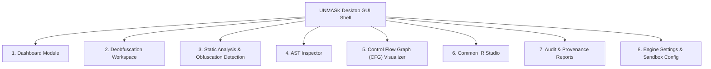

# UNMASK Technical Capability & Architecture Audit Report

**Document Version:** 1.0.0  
**Audit Date:** 2026-09-24  
**Audited System:** UNMASK (Universal Deobfuscator Framework)  
**Target Audience:** GUI Architecture & Design Engineering (Google Stitch Design Specification)  
**Audit Principle:** Zero assumption — only features, modules, and limits verified in the actual codebase are documented.

---

## 1. Current Architecture

The UNMASK framework is implemented as an extensible multi-tier compiler and abstract syntax tree (AST) transformation engine. It is written in pure Python (standard library only, Python 3.11+) with no external package dependencies.

### 1.1 Implemented Execution Pipeline

```text
[Input Source / Bytecode]
           │
           ▼
[Language Registry Detection]  (languages/__init__.py: LanguageRegistry)
           │
           ▼
[Language Frontend Parser]     (AST Generation: Python ast / JS/TS ESTree / Java / Go)
           │
           ├────────────────────────────────────────┬────────────────────────────────────────┐
           │                                        │                                        │
           ▼ (Native Pipeline)                      ▼ (Universal IR Pipeline)                ▼ (Security Inspection)
[Static Analysis Passes]                  [IR Converter Lowering]                  [Static Pattern Detection]
 - Reaching Definitions                   - to_ir() lowering                       (main.py: analyze_command)
 - Dataflow & Def-Use                      (languages/*/ir_converter.py)           - AST Node Counting
 - Control Flow Flattening (CFF)                    │                              - Decoder Calls Scan
 - Call Graph & Inlining                            ▼                              - CFF Loop Detection
 - Symbolic Algebra Engine                [Common IR Tree]                                   │
           │                              (core/ir.py: IRModule)                             ▼
           ▼                                        │                              [Terminal Metrics Output]
[AST Transformation Passes]                         ▼
 - Constant Propagation                   [IR CFG Engine]
 - Expression Folding                     (core/ir_cfg.py: IRCFG)
 - String Reconstruction                            │
 - Decoder Detection & Evaluation                   ▼
 - Algebraic Simplification               [Universal IR Passes]
 - Dead Code Elimination                  (core/ir_passes/)
 - CFG Reduction (Branch Pruning)         - IRConstantPropagation
           │                              - IRStringReconstruction
           │                              - IRDecoderEvaluation
           │                              - IRExpressionFolding
           │                              - IRDeadCodeElimination
           │                                        │
           │                                        ▼
           │                              [IR Converter Raising]
           │                              - from_ir() raising
           │                                        │
           ├────────────────────────────────────────┘
           │
           ├────────────────────────────────────────┐
           │ (If --dynamic enabled for Python)      │
           ▼                                        │
[DynamicDecoderUnmasker]                            │
(dynamic/unmasker.py)                               │
           │                                        │
           ▼                                        │
[SecureSandbox Subprocess Worker]                   │
(dynamic/sandbox.py: POSIX rlimits)                 │
           │                                        │
           ▼                                        │
[ExecutionTracer (sys.settrace)]                    │
(dynamic/tracer.py: Step-capped tracer)             │
           │                                        │
           ├────────────────────────────────────────┘
           │
           ▼
[Provenance Tracker & Confidence Engine]
(core/provenance.py, core/confidence.py)
 - Transformation Audit Ledger (Step ID, Location, Original, Transformed)
 - Quantitative Confidence Scoring (0.0 to 1.0) & Level Breakdown
           │
           ▼
[Target Language Source Printer]
(languages/*/printer.py, Python ast.unparse)
           │
           ▼
[Emitted Output & Audit Reports]
 - Clean Deobfuscated Source Code
 - Formatted Audit Reports (Text / JSON / Markdown)
 - Common IR Dumps / ASCII CFG Renderings
```

### 1.2 Pipeline Component Verification

1. **Language Detection & Registry** (`languages/__init__.py`): Singleton `LanguageRegistry` mapping file extensions (`.py`, `.js`, `.ts`, `.java`, `.class`, `.jar`, `.go`) to concrete language handlers.
2. **Language Frontends**:
   - Python: stdlib `ast.parse` with `ValueError` (null-byte) and `RecursionError` wrappers (`languages/python/parser.py`).
   - JavaScript: Custom recursive-descent lexer (`languages/javascript/lexer.py`) and parser (`languages/javascript/parser.py`) producing ESTree-compatible AST.
   - TypeScript: Extended parser (`languages/typescript/parser.py`) parsing interfaces, type annotations, enums, generics, type assertions, and decorators.
   - Java: Recursive-descent Java grammar parser (`languages/java/source_parser.py`) and binary JVM `.class`/`.jar` decompiler (`languages/java/bytecode.py`).
   - Go: Recursive-descent Go parser (`languages/go/source_parser.py`) handling packages, imports, functions, structs, channels, `select`, `defer`.
3. **Common Intermediate Representation (Common IR)** (`core/ir.py`, `core/ir_pipeline.py`): Language-neutral tree representation with bidirectional lowering/raising across all 5 languages.
4. **Analysis Engines** (`analysis/`): AST-level CFG builder (`analysis/cfg.py`), CFF analyzer (`analysis/cff.py`), reaching definitions (`analysis/reaching_definitions.py`), symbolic evaluator (`analysis/symbolic.py`), type inference (`analysis/type_inference.py`), call graph builder (`analysis/callgraph.py`).
5. **Transformation Passes** (`passes/` and `languages/*/passes/`): Multi-pass rewriting engine operating iteratively until fixed-point convergence (`core/pipeline.py`).
6. **Dynamic Subprocess Sandbox** (`dynamic/`): Optional worker process executing isolated decoding routines under Linux POSIX resource limits (`RLIMIT_AS`, `RLIMIT_CPU`, `RLIMIT_FSIZE`, `RLIMIT_NPROC`).
7. **Provenance & Confidence** (`core/provenance.py`, `core/confidence.py`): Non-destructive audit trail recording every AST replacement with file, line, column coordinates and categorical confidence ratings.

---

## 2. Command Line Interface (CLI)

The CLI entry point is implemented in [`main.py`](file:///home/sayantan/universal-deobfuscator/main.py) and exposed globally as `unmask` (with symlinks `UNMASK`, `deobfuscator`, `deveil` in `~/.local/bin/` and `/usr/bin/`).

### 2.1 Implemented Subcommands

#### `detect`
- **Syntax**: `unmask detect <input>`
- **Purpose**: Detect the programming language of a source or binary file by extension and file signature.
- **Arguments**: `input` (path to target file).
- **Options**: `-v/--verbose`, `--debug`.
- **Input Type**: Any file path.
- **Output Type**: Text stdout: `File: <path>\nLanguage: <name>`.
- **Works**: YES (Tested and verified).
- **Limitations**: Relies strictly on file extension matching via `registry.detect_language`. Does not inspect magic bytes for text files (except `.class`/`.jar`).

#### `parse`
- **Syntax**: `unmask parse <input> [-l/--language LANG] [--show-ast] [--unparse] [--target-js]`
- **Purpose**: Validate syntax, print AST node tree, or re-synthesize clean source code.
- **Arguments**: `input` (target file).
- **Options**:
  - `-l, --language`: Override automatic language detection.
  - `--show-ast`: Print AST dump (Python `ast.dump`, or node dump for JS/TS/Java/Go).
  - `--unparse`: Print regenerated source code after parsing.
  - `--target-js`: Strip TypeScript type annotations and output ECMAScript.
- **Input Type**: Source file (`.py`, `.js`, `.ts`, `.java`, `.go`) or compiled bytecode (`.class`, `.jar`).
- **Output Type**: Text dump to stdout. Exit code `0` on success, `1` on file/language error, `2` on syntax error.
- **Works**: YES.
- **Limitations**: `--show-ast` prints standard python `ast.dump` for Python; for custom AST languages, prints textual representation.

#### `analyze`
- **Syntax**: `unmask analyze <input> [-l/--language LANG]`
- **Purpose**: Inspect file structure, count AST nodes, and detect active obfuscation patterns using static heuristics without modifying the file.
- **Arguments**: `input` (target file).
- **Options**: `-l, --language`.
- **Input Type**: Source file.
- **Output Type**: Text summary to stdout: AST node count, validity status, detected patterns (Decoders, CFF loops). Exit code `0` on success, `2` on syntax error.
- **Works**: YES.
- **Limitations**: Detailed pattern detection heuristics currently cover Python AST constructs (Decoders & CFF); other languages report grammar validity and node counts.

#### `report`
- **Syntax**: `unmask report <input> [-o OUTPUT] [-l LANG] [--format {text,json,markdown}] [--use-ir] [--min-confidence LEVEL] [--confidence] [--dynamic]`
- **Purpose**: Perform deobfuscation analysis and generate a comprehensive transformation audit and provenance report without altering the input file.
- **Arguments**: `input` (target file).
- **Options**:
  - `-o, --output`: Write report to file instead of stdout.
  - `--format`: Choose output format: `text` (default), `json`, or `markdown`.
  - `--use-ir`: Run transformations through Common IR pipeline.
  - `--min-confidence`: Filter transformations below threshold (`CERTAIN`, `HIGH`, `MEDIUM`, `LOW`, `UNKNOWN`).
  - `--dynamic`: Enable opt-in secure dynamic analysis.
- **Input Type**: Source file.
- **Output Type**: Formatted audit report text, JSON document, or Markdown table.
- **Works**: YES.
- **Limitations**: None.

#### `deobfuscate`
- **Syntax**: `unmask deobfuscate <input> [-o OUTPUT] [-l LANG] [--target-js] [--use-ir] [--report] [--format {text,json,markdown}] [--min-confidence LEVEL] [--confidence] [--max-iterations N] [--dynamic] [--no-dynamic]`
- **Purpose**: Run the full iterative deobfuscation pipeline and produce cleaned source code.
- **Arguments**: `input` (target file).
- **Options**:
  - `-o, --output`: File path to save deobfuscated source code.
  - `-l, --language`: Explicit language override.
  - `--target-js`: Strip TypeScript constructs, producing clean JavaScript.
  - `--use-ir`: Lower to Common IR and run universal optimization passes.
  - `--report`: Output provenance audit report.
  - `--format`: Report format (`text`, `json`, `markdown`).
  - `--confidence`: Print summary confidence score and metrics breakdown.
  - `--min-confidence`: Threshold filter (default: `LOW`).
  - `--max-iterations`: Loop iteration limit for pipeline convergence (default: `10`).
  - `--dynamic`: Enable secure dynamic sandbox unmasking (default: disabled).
  - `--no-dynamic`: Explicitly disable dynamic execution.
- **Input Type**: Source file or JVM class/jar.
- **Output Type**: Cleaned code to stdout or file, plus optional report and confidence scores.
- **Works**: YES.
- **Limitations**: Dynamic unmasking is opt-in and currently implemented for Python payload decoders.

#### `ir`
- **Syntax**: `unmask ir <input> [-o OUTPUT] [-l LANG] [-O] [--cfg] [--roundtrip] [--target-js] [--report] [--format {text,json,markdown}] [--max-iterations N]`
- **Purpose**: Interact directly with the language-neutral Common Intermediate Representation.
- **Arguments**: `input` (target file).
- **Options**:
  - `-o, --output`: Save IR dump or roundtripped source to file.
  - `-O, --optimize`: Run universal IR optimization passes (Constant folding, dead code elimination, control flow simplification).
  - `--cfg`: Generate and display ASCII Control Flow Graph of basic blocks and edges.
  - `--roundtrip`: Translate source $\rightarrow$ IR $\rightarrow$ target source code and unparse.
  - `--target-js`: Strip TypeScript annotations during roundtrip.
  - `--report`: Emit provenance report for IR passes.
- **Input Type**: Source file of any supported language.
- **Output Type**: Textual IR dump, ASCII CFG diagram, or roundtripped source code.
- **Works**: YES.
- **Limitations**: ASCII CFG diagram is terminal-rendered; GUI will need a native node-graph component.

#### `interactive`
- **Syntax**: `unmask interactive`
- **Purpose**: Launches the interactive console menu.
- **Works**: YES.

### 2.2 Execution Behavior for `unmask` and `UNMASK`

When a user executes `unmask` or `UNMASK` in their terminal:
1. **Interactive TTY (User terminal)**: If executed with **no arguments** in an interactive terminal session (`len(sys.argv) == 1 and sys.stdin.isatty()`), it immediately displays the cyber-styled ASCII banner and launches the interactive menu.
2. **Piped / Non-interactive session**: If executed without arguments in a script, pipe, or headless test (`not sys.stdin.isatty()`), it outputs standard CLI usage/help instructions and exits cleanly with code `0`.
3. **`UNMASK`**: The binary `/home/sayantan/.local/bin/UNMASK` is a symlink to `/home/sayantan/.local/bin/unmask`. It invokes the exact same engine and provides identical capabilities.

### 2.3 The Interactive Console Interface

When running in interactive mode, the terminal displays:

```text
  ██╗   ██╗███╗   ██╗███╗   ███╗ █████╗ ███████╗██╗  ██╗
  ██║   ██║████╗  ██║████╗ ████║██╔══██╗██╔════╝██║ ██╔╝
  ██║   ██║██╔██╗ ██║██╔████╔██║███████║███████╗█████╔╝ 
  ██║   ██║██║╚██╗██║██║╚██╔╝██║██╔══██║╚════██║██╔═██╗ 
  ╚██████╔╝██║ ╚████║██║ ╚═╝ ██║██║  ██║███████║██║  ██╗
   ╚═════╝ ╚═╝  ╚═══╝╚═╝     ╚═╝╚═╝  ╚═╝╚══════╝╚═╝  ╚═╝
  :: UNMASK - Universal Code Deobfuscator & Reverse Engineering Engine ::
  -------------------------------------------------------------------------
  [*] Engine Mode  : Multi-Tier AST Normalizer & Common IR
  [*] Supported    : Python | JavaScript | TypeScript | Java | Go
  [*] Capabilities : CFF Recovery, String Decoding, Symbolic Folding, CFG
  [*] Isolation    : Bounded Dynamic Execution Sandbox
  -------------------------------------------------------------------------

[ CORE OPERATIONS ]
  [1] ⚡ Deobfuscate Payload      (Unpack, decode strings, simplify logic)
  [2] 🔍 Static Analysis          (Inspect obfuscation patterns & metrics)
  [3] ⚙️  Syntax & AST Dump        (Validate grammar, view AST / clean code)
  [4] 🌐 Common IR Tools          (Universal IR optimization / CFG graph)
  [5] 🔎 Detect Language          (Analyze file signatures & headers)
  [6] ❌ Terminate Session

unmask@engine:~# 
```

The user selects options `[1-6]`. Prompts feature path sanitization (stripping surrounding quotes from terminal drag-and-drop), toggle switches for output paths, confidence metrics, audit reports, and sandbox execution.

---

## 3. Supported Languages

| Language | Detection | Parser | Analysis | Deobfuscation | Printer | Status |
| :--- | :---: | :---: | :---: | :---: | :---: | :---: |
| **Python** | `.py`, `.pyw` | Python 3.11+ stdlib `ast` | Full (CFG, CFF, Dataflow, Reaching Defs, Symbolic, Types) | 12 Native Passes + Dynamic Unmasker + Common IR | `ast.unparse` + SourceLocation extractor | **IMPLEMENTED** |
| **JavaScript** | `.js`, `.mjs`, `.cjs` | Custom Recursive-Descent ESTree Lexer/Parser | AST property, IIFE structure, constant folding | 6 Native JS Passes + Common IR | `JSPrinter` (ESTree $\rightarrow$ JS) | **IMPLEMENTED** |
| **TypeScript** | `.ts`, `.tsx`, `.mts`, `.cts` | Recursive-Descent Parser with Type Grammars | Type annotations, interfaces, enums, generics | 6 JS Passes + Common IR | `TSPrinter` (Preserves types OR emits clean JS) | **IMPLEMENTED** |
| **Java (Source)** | `.java` | Custom Recursive-Descent Java Parser | AST class, method, variable declaration analysis | 5 Native Java Passes + Common IR | `JavaPrinter` (Java AST $\rightarrow$ Java code) | **IMPLEMENTED** |
| **Java Bytecode** | `.class`, `.jar` | Pure stdlib JVM Classfile Decompiler | Constant pool, bytecode opcode parsing | Decompiled into Java AST $\rightarrow$ passes | `JavaPrinter` | **IMPLEMENTED** |
| **Go** | `.go` | Custom Recursive-Descent Go Parser | AST package, struct, func, channel, defer analysis | 5 Native Go Passes + Common IR | `GoPrinter` (Go AST $\rightarrow$ Go code) | **IMPLEMENTED** |

### Additional Languages Verified in Codebase:
- **Java Bytecode (`java-bytecode`)**: Registered as an independent language handler in `languages/java/__init__.py` with direct `.class` and `.jar` parsing.

---

## 4. Deobfuscation Capabilities

Every transformation listed below is confirmed in the current implementation.

### 4.1 String Transformations

| Transformation | Language Scope | Implementing Module & Class | Mechanism / Details |
| :--- | :--- | :--- | :--- |
| **Base64 Decoding** | Universal / Multi-lang | `decoders/base64_decoder.py` (`Base64Decoder`), `passes/decoder_detection.py`, `languages/javascript/passes/decoders.py`, `core/ir_passes/decoders.py` | Detects `base64.b64decode`, `urlsafe_b64decode`, `atob`, `btoa`. Decodes compile-time string/byte literals. |
| **Hex Decoding** | Universal / Multi-lang | `decoders/hex_decoder.py` (`HexDecoder`), `passes/decoder_detection.py`, `core/ir_passes/decoders.py` | Detects `bytes.fromhex`, `binascii.unhexlify`, hex string literals, and byte escapes. |
| **Unicode / Codec Decoding** | Python / JavaScript | `decoders/unicode_decoder.py` (`UnicodeDecoder`), `passes/decoder_detection.py`, `languages/javascript/passes/decoders.py` | Evaluates `codecs.decode(..., 'unicode_escape')`, `unescape()`, and unicode escape sequences. |
| **`chr()` / Character Codes** | Universal / Multi-lang | `passes/string_reconstruction.py` (`StringReconstructionTransformer._eval_chr_call`), `languages/javascript/passes/string_reconstruction.py`, `core/ir_passes/string_reconstruction.py` | Replaces `chr(constant)` and `String.fromCharCode(...)` with literal character constants. |
| **String `join()`** | Universal / Multi-lang | `passes/string_reconstruction.py`, `languages/javascript/passes/string_reconstruction.py`, `core/ir_passes/string_reconstruction.py` | Evaluates `"sep".join(["a", "b", ...])` and `[...].join("sep")` when elements and separator are constant. |
| **String Reversal** | Python / JavaScript | `passes/string_reconstruction.py` (`visit_Subscript`), `languages/javascript/passes/string_reconstruction.py` | Folds Python slice reversal `s[::-1]` and JS idiom `s.split('').reverse().join('')`. |
| **String Concatenation** | Universal / Multi-lang | `passes/string_reconstruction.py` (`visit_BinOp`), `languages/javascript/passes/expression_folding.py`, `languages/java/passes/string_reconstruction.py`, `languages/go/passes/string_reconstruction.py`, `core/ir_passes/expression_folding.py` | Folds adjacent binary string additions (`"hello " + "world"` $\rightarrow$ `"hello world"`). |
| **XOR Decryption** | Universal / Multi-lang | `decoders/xor_decoder.py` (`XORDecoder`), `analysis/symbolic.py` (`eval_binop` for `^`), `passes/symbolic_evaluation.py` | Evaluates constant XOR expressions and algebraic cancellations (`(x ^ k) ^ k` $\rightarrow$ `x`). |
| **Compression (zlib / gzip)** | Python / Decoders | `decoders/compression_decoder.py` (`ZlibDecoder`, `GzipDecoder`), `passes/decoder_detection.py` | Detects and decompresses constant buffers in `zlib.decompress` and `gzip.decompress`. |
| **URL Decoding** | Python / JavaScript | `decoders/url_decoder.py` (`URLDecoder`), `passes/decoder_detection.py`, `languages/javascript/passes/decoders.py` | Evaluates `urllib.parse.unquote` and `decodeURIComponent(...)`. |
| **Nested / Multi-Stage Decoding** | Universal | `core/pipeline.py` (`Pipeline.execute` with `until_convergence=True`) | Repeatedly iterates passes until no further transformations occur, unmasking layered obfuscation (e.g. Base64 inside Hex inside reversed string). |

### 4.2 Constant Analysis

| Capability | Language Scope | Implementing Module & Class | Mechanism / Details |
| :--- | :--- | :--- | :--- |
| **Constant Propagation** | Python | `passes/constant_propagation.py` (`ConstantPropagatorTransformer`, `ScopeContext`) | Tracks single-assignment variables across lexical scopes (including module-level globals accessed in functions) and substitutes constant values. |
| **Constant Propagation (JS/TS)** | JavaScript / TypeScript | `languages/javascript/passes/constant_propagation.py` (`JSConstantPropagationTransformer`) | Scoped variable tracking for `var`, `let`, `const` with reassignment invalidation. |
| **Constant Propagation (Java/Go)** | Java / Go | `languages/java/passes/constant_propagation.py`, `languages/go/passes/constant_propagation.py` | Scoped tracking for Java fields/locals and Go variables. |
| **Universal IR Constant Propagation** | Common IR | `core/ir_passes/constant_propagation.py` (`IRConstantPropagation`) | Language-neutral variable value tracking across IR blocks. |
| **Arithmetic Folding** | Universal / Multi-lang | `passes/expression_folding.py` (`ExpressionFoldingTransformer.visit_BinOp`), `languages/javascript/passes/expression_folding.py`, `core/ir_passes/expression_folding.py` | Evaluates `+`, `-`, `*`, `/`, `//`, `%`, `**`, `<<`, `>>`, `&`, `|`, `^`. Includes zero-division guards. |
| **Boolean Folding** | Universal / Multi-lang | `passes/expression_folding.py`, `passes/simplify.py` (`SimplificationTransformer`) | Evaluates `and`, `or`, `not`, comparison chains, and boolean identities. |
| **String & Format Folding** | Python | `passes/expression_folding.py` (`visit_JoinedStr`, `visit_FormattedValue`) | Folds constant f-strings, `%` format expressions, and `.format()` invocations. |

### 4.3 Control Flow Transformations

| Capability | Language Scope | Implementing Module & Class | Mechanism / Details |
| :--- | :--- | :--- | :--- |
| **Dead Code Elimination** | Python / Common IR / Java / Go | `passes/dead_code.py` (`DeadCodeEliminationTransformer`), `core/ir_passes/dead_code.py`, `languages/java/passes/dead_code.py`, `languages/go/passes/dead_code.py` | Removes dead assignments (unreferenced variables without side effects) and statements following unconditional returns. |
| **Unreachable Branch Pruning** | Python / Common IR | `passes/cfg_reduction.py` (`CFGReductionTransformer`), `analysis/cfg.py` (`ControlFlowGraph.compute_reachable_blocks`) | Evaluates constant branch guards (`if True:`, `if False:`) and replaces the branch with the active block. |
| **Opaque Predicate Elimination** | Python | `passes/simplify.py` (`SimplificationTransformer`), `passes/symbolic_evaluation.py` | Resolves mathematical tautologies (`x - x == 0`, `x ^ x == 0`, `(x * 0) == 0`) used as opaque conditional guards. |
| **Control-Flow Flattening (CFF) Recovery** | Python | `passes/cff_recovery.py` (`ControlFlowFlatteningTransformer`), `analysis/cff.py` (`ControlFlowFlatteningAnalyzer`) | Identifies dispatcher loops (`while state != exit:`), maps symbolic transitions across case handlers, reconstructs linear statement sequences and structured `if/else` trees, and removes state dispatch variables. |
| **Function Inlining** | Python | `passes/function_inlining.py` (`FunctionInliningTransformer`), `analysis/callgraph.py` | Inlines trivial single-expression wrapper functions and constant-returning proxy routines. |
| **IIFE Normalization** | JavaScript / TypeScript | `languages/javascript/passes/iife_normalization.py` (`JSIIFENormalizationTransformer`) | Normalizes Immediately Invoked Function Expressions (`(function() { return 42; })()`), converting them to direct values or inlined statements. |
| **Property Access Normalization** | JavaScript / TypeScript | `languages/javascript/passes/property_normalization.py` (`JSPropertyNormalizationTransformer`) | Normalizes bracket property accesses with valid identifier names (`window['document']` $\rightarrow$ `window.document`). |

### 4.4 Data Flow Analysis

| Capability | Language Scope | Implementing Module & Class | Mechanism / Details |
| :--- | :--- | :--- | :--- |
| **Reaching Definitions** | Python | `analysis/reaching_definitions.py` (`ReachingDefinitionsAnalyzer`) | Computes iterative bit-vector dataflow sets (`GEN`, `KILL`, `IN`, `OUT`) across AST statement blocks. |
| **Def-Use & Use-Def Chains** | Python | `analysis/reaching_definitions.py` (`build_def_use_chains`), `analysis/dataflow.py` (`DataFlowAnalyzer`) | Links every variable assignment (`StmtDef`) to all downstream read occurrences (`StmtUse`). |
| **Variable Dependency Analysis** | Python | `analysis/reaching_definitions.py` (`DependencyGraph`) | Builds directed graphs of variable dependencies to trace transitive derivations (`x = y + 1`). |
| **Variable Liveness Tracking** | Python | `analysis/dataflow.py` (`DataFlowAnalyzer.analyze_liveness`) | Determines live variable ranges to identify dead stores. |

### 4.5 Symbolic Analysis

| Capability | Language Scope | Implementing Module & Class | Mechanism / Details |
| :--- | :--- | :--- | :--- |
| **Symbolic Expression Modeling** | Python | `analysis/symbolic.py` (`SymbolicValue`, `SymbolicConstant`, `SymbolicVariable`, `SymbolicBinaryOp`, `SymbolicUnaryOp`) | AST expressions converted into a symbolic tree allowing algebraic manipulation. |
| **Self-Canceling Algebra** | Python | `passes/symbolic_evaluation.py` (`SymbolicEvaluationTransformer`), `analysis/symbolic.py` | Simplifies algebraic obfuscations: `(x + k) - k` $\rightarrow$ `x`, `x ^ k ^ k` $\rightarrow$ `x`, `x * 1` $\rightarrow$ `x`, `x - x` $\rightarrow$ `0`. |
| **Bitwise / Logic Reductions** | Python | `analysis/symbolic.py` (`SymbolicUnaryOp.simplify`, `SymbolicBinaryOp.simplify`) | Simplifies `~~x` $\rightarrow$ `x`, `not not x` $\rightarrow$ `bool(x)`, `x & 0` $\rightarrow$ `0`, `x | 0` $\rightarrow$ `x`. |

---

## 5. Common Intermediate Representation (Common IR)

A complete, working Common Intermediate Representation is implemented in the repository.

### 5.1 Implemented IR Hierarchy (`core/ir.py`)

- **Root & Structural Nodes**:
  - `IRNode`: Base class with `location: SourceLocation` and `metadata: Dict[str, Any]`.
  - `IRModule`: Top-level compilation unit containing statements and metadata.
  - `IRFunction`: Function definition with `name`, `params` (list of `(name, type)`), `return_type`, `body` statements, and docstrings.
  - `IRBlock`: Group of sequential IR statements.
- **Statements (`IRStatement`)**:
  - `IRAssignment`: Variable or target assignment (`target`, `value`).
  - `IRBranch`: Conditional branching (`condition`, `body`, `orelse`).
  - `IRLoop`: Loop construct (`condition`, `body`, `is_for`, `init`, `update`).
  - `IRReturn`: Return statement with optional `value`.
  - `IRException`: Raise / throw statement.
  - `IRTryCatch`: Exception handling with `body`, `handlers` (with exception type and variable), `orelse`, and `finalbody`.
  - `IRImport`: Module imports with `module_name`, `alias`, and `imported_names` map.
- **Expressions (`IRExpression`)**:
  - `IRConstant`: Concrete literal values (int, float, bool, None).
  - `IRString`: Specialized string constant with `encoding` and `is_raw` attributes.
  - `IRVariable`: Variable identifier reference with type annotations.
  - `IRBinaryOperation`: Binary operator (`+`, `-`, `*`, `/`, `%`, `&`, `|`, `^`, `<<`, `>>`, `==`, `!=`, `<`, `>`, `<=`, `>=`, `and`, `or`).
  - `IRUnaryOperation`: Unary operator (`-`, `+`, `~`, `not`).
  - `IRCall`: Routine invocation with `callee`, `args`, and `kwargs`.
  - `IRMemberAccess`: Attribute / property access (`target.member`).
  - `IRIndexAccess`: Array / map index access (`target[index]`).
  - `IRListLiteral`: Array / list construct (`elements`).
  - `IRDictLiteral`: Map / dictionary construct (`keys`, `values`).

### 5.2 Bidirectional Language Lowering & Raising

Each supported language provides a dedicated IR converter:

1. **Python** (`languages/python/ir_converter.py`): `PythonIRConverter.to_ir(tree)` lowers Python AST to `IRModule`; `PythonIRConverter.from_ir(module)` raises `IRModule` to Python AST.
2. **JavaScript** (`languages/javascript/ir_converter.py`): `JSIRConverter.to_ir(ast)` / `from_ir(module)`.
3. **TypeScript** (`languages/typescript/ir_converter.py`): `TSIRConverter.to_ir(ast)` / `from_ir(module)`. Preserves TypeScript types in IR node metadata.
4. **Java** (`languages/java/ir_converter.py`): `JavaIRConverter.to_ir(cu)` / `from_ir(module)`. Maps classes and methods into IR structures.
5. **Go** (`languages/go/ir_converter.py`): `GoIRConverter.to_ir(file)` / `from_ir(module)`. Maps packages, functions, and statements to IR.

### 5.3 IR Control Flow Graph (IR CFG) (`core/ir_cfg.py`)

- `IRCFG`: Directed graph of `IRBasicBlock` nodes.
- `IRBasicBlock`: Stores block ID, label, list of `IRStatement` instructions, and predecessor/successor edges.
- `IRCFGEdge`: Edges with types: `FALLTHROUGH`, `BRANCH_TRUE`, `BRANCH_FALSE`, `JUMP`.
- `IRCFG.to_ascii()`: Emits an ASCII block diagram showing entry, branches, statements, and loop-backs.

### 5.4 Universal IR Passes (`core/ir_passes/`)

- `IRConstantPropagation`: Propagates constants across assignments in IR blocks.
- `IRStringReconstruction`: Folds string operations and character sequences at the IR level.
- `IRDecoderEvaluation`: Evaluates Base64, Hex, and character calls in IR.
- `IRExpressionFolding`: Evaluates arithmetic and logic in `IRBinaryOperation`.
- `IRDeadCodeElimination`: Removes unused assignments and unreachable blocks.

### 5.5 IR Limitations & Gaps

- **Language-specific constructs**: Advanced metaprogramming (Python decorators, generators/`yield`, context managers `with`; JavaScript `async`/`await`, generator functions; Go goroutines/`select`; Java synchronized blocks) are represented via generic statement wrappers or metadata dictionaries rather than dedicated semantic IR nodes. Roundtripping through Common IR for highly specialized constructs produces valid code but may desugar syntax.

---

## 6. Static Analysis Capabilities

| Analysis Module | Purpose | Implementation File | Output Data | Confidence / Reliability | Limitations |
| :--- | :--- | :--- | :--- | :--- | :--- |
| **Control Flow Graph (AST)** | Structural basic block and branch analysis | `analysis/cfg.py` (`ControlFlowGraph`) | Block list, edge list, reachable blocks set, dominators map, natural loops | High (Formal graph theory) | Python AST specific. |
| **IR Control Flow Graph** | Cross-language basic block and edge analysis | `core/ir_cfg.py` (`IRCFG`) | Basic blocks, edge types (`BRANCH_TRUE`, `FALLTHROUGH`), ASCII diagram | High | Operates on Common IR. |
| **Control Flow Flattening Analysis** | Detects state machine dispatch loops | `analysis/cff.py` (`ControlFlowFlatteningAnalyzer`) | `CFFDispatcher` object (state variable, initial state, state transitions map, exit states) | High (Symbolic transition tracing) | Targets while-switch / while-if dispatchers; does not trace multi-variable flattened state machines. |
| **Reaching Definitions** | Computes active variable assignments | `analysis/reaching_definitions.py` (`ReachingDefinitionsAnalyzer`) | Def-use map, use-def map, `DependencyGraph` | High (Dataflow fixpoint) | Intra-procedural analysis. |
| **Symbolic Expression Evaluation** | Evaluates algebraic and bitwise relationships | `analysis/symbolic.py` (`SymbolicEngine`) | Simplified symbolic trees, constant status, free variables set | High | Bounded to linear and bitwise arithmetic; non-linear polynomial systems unreduced. |
| **Type Inference** | Infers concrete variable and return types | `analysis/type_inference.py` (`TypeInferenceEngine`) | Map of variable names $\rightarrow$ inferred type strings | Medium (Conservative typing) | Infers primitive types and basic standard collections. |
| **Call Graph Analysis** | Traces callers, callees, and function purity | `analysis/callgraph.py` (`CallGraphAnalyzer`) | Callers map, callees map, `FunctionSignature` (purity, wrapper status, constant return) | High | Static lexical resolution; dynamic function pointers / reflection unresolved. |
| **Import & Alias Analysis** | Resolves imported symbol aliases and renames | `analysis/imports.py` (`ImportAnalyzer`) | `module_aliases` map, `symbol_aliases` map (`ResolvedTarget`) | High | Intra-file lexical imports. |
| **Static Obfuscation Detector** | Scans AST for obfuscation signatures | `main.py` (`analyze_command`) | AST node count, syntax status, detected pattern list | High | Pattern-based heuristics. |

---

## 7. Dynamic Analysis & Sandbox Architecture

Dynamic execution is strictly opt-in via `--dynamic` and is isolated from the host analyzer process.

### 7.1 Security Architecture Inspection

- **Isolation Mechanism**: Subprocess worker isolation using Python's `multiprocessing.Process` (`dynamic/sandbox.py: _worker_process_target`).
- **Process vs Container vs VM**:
  - **Verdict**: It is an **OS-level resource-constrained worker subprocess**, **NOT a container (Docker/Podman)** and **NOT a virtual machine (KVM/QEMU/Firecracker)**.
  - The analyzer process NEVER runs `eval()`, `exec()`, or `__import__()` on untrusted code inside the host process.
- **Resource Constraints (POSIX Linux)**:
  - **CPU Limit**: Enforced via `resource.setrlimit(resource.RLIMIT_CPU, (timeout, timeout + 1))`.
  - **Memory Ceiling**: Enforced via `resource.setrlimit(resource.RLIMIT_AS, (64MB, 64MB))`.
  - **File Creation Limit**: Enforced via `resource.setrlimit(resource.RLIMIT_FSIZE, (0, 0))` (max file write size is 0 bytes).
  - **Core Dump Disabling**: Enforced via `resource.setrlimit(resource.RLIMIT_CORE, (0, 0))`.
  - **Fork Bomb Prevention**: Child process creation restricted.
- **Timeout Enforcement**: Host process waits up to `policy.timeout_seconds` (default: 2.0s). If exceeded, host sends `process.terminate()` and falls back to `process.kill()` (SIGKILL).
- **Filesystem Restrictions**: Changes working directory to an isolated ephemeral `tempfile.TemporaryDirectory(prefix="deobf_sandbox_")`. `open()` is removed from builtins. File size limit `0` prevents disk writes.
- **Network Restrictions**: Socket module creation is blocked (`safe_builtins["socket"] = blocked_socket`). Imports of `socket`, `http`, `urllib.request`, `requests` are blocked by `_make_safe_import`.
- **Environment Sanitization**: `os.environ.clear()` clears all host environment variables, tokens, and PATHs.
- **Builtin Sanitization**: Prohibits dangerous builtins: `open`, `eval`, `exec`, `input`, `breakpoint`, `compile`, `memoryview`.
- **Module Whitelist**: Only whitelisted safe decoding modules can be imported: `math`, `string`, `base64`, `binascii`, `zlib`, `gzip`, `bz2`, `lzma`, `urllib.parse`, `codecs`, `json`, `struct`, `re`.
- **Execution Step Tracer**: `dynamic/tracer.py` uses `sys.settrace` inside the child process. Tracks line execution events and enforces a hard limit of `10,000` steps (`max_steps`) to prevent CPU spinlocks.
- **Captured Output**: Stdout and stderr are redirected to in-memory `io.StringIO` buffers, capped at `max_output_bytes` (10KB), and returned via IPC `multiprocessing.Queue`.

---

## 8. Confidence & Provenance Engine

The engine maintains a complete, non-destructive audit log of all transformations.

### 8.1 Confidence Ratings (`core/confidence.py`)

- **Confidence Levels**:
  - `CERTAIN` (Value: `1.0`): Provable mathematical equivalence (e.g. constant arithmetic folding, static Base64 decode).
  - `HIGH` (Value: `0.8`): Highly reliable structural transformation (e.g. dead branch elimination on constant boolean).
  - `MEDIUM` (Value: `0.5`): Inferred transformation with potential subtle side-effect considerations (e.g. function inlining).
  - `LOW` (Value: `0.2`): Heuristic approximation.
  - `UNKNOWN` (Value: `0.0`): Unresolved or ambiguous dynamic construct.
- **Transformation Categories**:
  - `RECOVERED`: Unmasked hidden payload, decoded string, or recovered flattened control flow.
  - `INFERRED`: Deduced data type, variable constant, or property access.
  - `SIMPLIFIED`: Folded expression, algebraic cancellation, or dead code elimination.
  - `UNRESOLVED`: Flagged dynamic construct retained in original form.

### 8.2 Provenance Tracking (`core/provenance.py`)

Each transformation step produces a `ProvenanceRecord`:
- `step_id`: Monotonically increasing sequential index.
- `pass_name`: Identifying name of the executing pass.
- `original`: Code snippet prior to transformation.
- `transformed`: Code snippet emitted by transformation.
- `confidence`: `Confidence` instance (level, score, category, reason).
- `location`: `SourceLocation` instance with `filename`, `start_line`, `start_col`, `end_line`, `end_col`.

---

## 9. Output Capabilities

| Output Type | Format | Access Method | Description |
| :--- | :--- | :--- | :--- |
| **Cleaned Source** | Raw source file | `unmask deobfuscate in.py -o out.py` or stdout | Canonical, readable source code in the target language. |
| **Audit Report (Text)** | Human-readable text | `unmask deobfuscate in.py --report` (or `unmask report in.py`) | Summary table, total count, confidence average, line-by-line step log. |
| **Audit Report (JSON)** | Structured JSON | `unmask report in.py --format json` | Machine-readable JSON object with total transformations, confidence score, category breakdown, and list of all step records. |
| **Audit Report (Markdown)** | Markdown document | `unmask report in.py --format markdown` | GFM formatted Markdown with tables and confidence badges. |
| **AST Dump** | Textual AST tree | `unmask parse in.py --show-ast` | Full structural syntax tree dump with node attributes. |
| **Regenerated Source** | Source code | `unmask parse in.py --unparse` | Normalized code output directly from the frontend parser. |
| **ASCII Control Flow Graph** | ASCII art diagram | `unmask ir in.py --cfg` | Textual rendering of basic blocks, statements, conditional branch labels, and loop connections. |
| **Common IR Dump** | Language-neutral IR text | `unmask ir in.py` (or `-O`) | Raw Common Intermediate Representation syntax dump. |
| **TypeScript $\rightarrow$ JavaScript** | ECMAScript | `unmask deobfuscate in.ts --target-js` | Clean JavaScript output with all TypeScript type syntax stripped. |

---

## 10. GUI-Relevant Functional Modules

The existing backend modules map directly to the following functional subsystems for GUI design:



### Module 1: Dashboard
- **Engine Status**: Framework version (1.0.0), active Python environment, sandbox availability.
- **Language Hub**: Supported language cards (Python, JavaScript, TypeScript, Java, Java Bytecode, Go) with extension lists and feature tags.
- **Quick File Scanner**: Drag-and-drop file target displaying detected language, file size, and line count.
- **Analysis Metrics**: Total files analyzed, cumulative transformations applied, average confidence score.

### Module 2: Deobfuscation Workspace
- **Dual-Pane Code Editor**:
  - Left pane: Input obfuscated source code (syntax highlighted).
  - Right pane: Deobfuscated recovered code (syntax highlighted).
  - Synchronized scrolling and side-by-side Diff view.
- **Action Controls**:
  - `Deobfuscate` (Execute standard pipeline).
  - `Deobfuscate via Common IR` (Run through Common IR lowering).
  - `Dynamic Sandbox Unmask` (Toggle isolated subprocess execution).
- **Live Transformation Feed**: Real-time table of applied transformations with Step ID, Pass Name, Category tag, Confidence pill badge (`CERTAIN`, `HIGH`, `MEDIUM`), and source line jump link.

### Module 3: Static Analysis & Obfuscation Detection
- **Obfuscation Signature Scanner**: Cards indicating detected obfuscation techniques:
  - Base64 / Hex / Unicode / URL Encoded Strings.
  - Control-Flow Flattening (CFF) Dispatcher Loops.
  - Array / String Reconstruction Sequences.
  - Opaque Predicates & Dead Branches.
- **Code Metrics**: AST node count, function count, Cyclomatic complexity, Variable dependency depth.
- **Dependency & Call Graph**: Visual table showing caller-callee relationships and variable def-use dependencies.

### Module 4: AST Inspector
- **Interactive Syntax Tree**: Hierarchical tree explorer displaying nodes (`FunctionDef`, `Assign`, `BinOp`, etc.).
- **Node Property Inspector**: Displays selected node properties (id, value, operator, line/column coordinates).
- **Code-to-Node Cross-Highlighting**: Clicking a node in the tree highlights the corresponding source code range in the editor.

### Module 5: Control Flow Graph (CFG) Visualizer
- **Interactive Node-Edge Graph**: Renders basic blocks as visual cards connected by directed edges:
  - Green edges: `True` conditional branches.
  - Red edges: `False` conditional branches.
  - Blue edges: Normal fallthrough transitions.
  - Orange edges: Loop back-edges.
- **Block Inspector**: Displays instructions contained in each basic block and reachability status (Reachable vs Dead).

### Module 6: Common IR Studio
- **IR Code Viewer**: Syntax-highlighted view of the language-neutral Common IR tree.
- **IR Optimization Playground**: Run universal IR optimization passes (`IRConstantPropagation`, `IRDeadCodeElimination`, `IRDecoderEvaluation`).
- **Roundtrip Comparator**: Visual verification showing original source $\rightarrow$ IR $\rightarrow$ raised target source.

### Module 7: Audit & Provenance Reports
- **Executive Summary Card**: Total transformations, execution duration, average confidence score.
- **Breakdown Charts**:
  - Pie/Bar chart of Confidence Levels (`CERTAIN`, `HIGH`, `MEDIUM`, `LOW`, `UNKNOWN`).
  - Breakdown by Category (`Recovered`, `Simplified`, `Inferred`, `Unresolved`).
- **Detailed Step Ledger**: Searchable, filterable table of all provenance records with line numbers, original snippets, and transformed replacements.
- **Export Toolbar**: One-click export to `JSON`, `Markdown`, or plain `Text`.

### Module 8: Engine Settings & Sandbox Config
- **Confidence Gate**: Slider/Dropdown setting minimum confidence threshold (`LOW`, `MEDIUM`, `HIGH`, `CERTAIN`).
- **Pipeline Limits**: Max pass iterations slider (1 to 20).
- **Sandbox Security Configuration**:
  - Max CPU timeout slider (0.5s to 10.0s).
  - Memory ceiling input (default: 64MB).
  - Step counter cap slider (1,000 to 50,000 steps).
  - Filesystem & Network access toggles (disabled by default).

---

## 11. Implemented User Workflow

```text
1. Launch UNMASK
   ├── Terminal CLI Mode: unmask deobfuscate target.py [options]
   └── Interactive Menu Mode: unmask (or UNMASK)
           │
2. Target File Ingestion
   ├── Provide input path (manual entry or drag-and-drop)
   └── Automated Language Detection (Registry matches extension / class bytes)
           │
3. Pre-Analysis (Optional)
   ├── Inspect Syntax & AST (unmask parse target.py --show-ast)
   └── Scan Obfuscation Signatures (unmask analyze target.py)
           │
4. Execution Configuration
   ├── Choose Execution Path: Native AST Passes vs Common IR Pipeline (--use-ir)
   ├── Set Confidence Threshold (--min-confidence LOW|MEDIUM|HIGH|CERTAIN)
   ├── Configure Dynamic Analysis (--dynamic for packed payload execution)
   └── Select TypeScript Output Mode (--target-js to strip TS types)
           │
5. Engine Processing
   ├── AST Generation & Normalization
   ├── Iterative Transformation Loops (until convergence or max iterations)
   └── Provenance Recording of all AST mutations
           │
6. Result Review & Verification
   ├── Compare Deobfuscated Output vs Original Source
   ├── Review Confidence Score & Breakdown
   └── Inspect ASCII Control Flow Graph (unmask ir target.py --cfg)
           │
7. Export & Artifact Generation
   ├── Save Cleaned Source (-o clean_code.py)
   └── Export Audit Report (--report --format text|json|markdown)
```

---

## 12. GUI Features That Must NOT Be Designed Yet

The following features appear in early architectural roadmap notes or general security discussions, but are **NOT implemented in the current backend**. The GUI must **NOT** present these as active or functional:

1. **Automated Taint Analysis & Vulnerability Scanner**:
   - `analysis/taint.py` is not implemented. There is no active taint sink/source tracer in the backend.
2. **Native Binary Disassembly (x86 / x64 / ARM / ELF / PE)**:
   - UNMASK supports source code for 5 languages and **JVM Bytecode (`.class`/`.jar`)**. It does NOT parse native machine code, ELF binaries, or Windows PE files.
3. **Hardware / Hypervisor MicroVM Sandboxing (KVM / QEMU / Docker / Firecracker)**:
   - Dynamic analysis uses an **OS-level resource-limited worker subprocess (`multiprocessing.Process`)**. The GUI must not market this as a hardware hypervisor or container jail.
4. **Automated AI/ML Variable Renamer**:
   - The tool reconstructs constants, control flow, and decoders; it does not currently integrate an LLM/ML neural de-minifier to guess original variable names like `arg133` $\rightarrow$ `check_password` (unless explicitly inferred from type/alias rules).
5. **Native Windows Executable Unpackers (UPX, Themida, VMProtect)**:
   - The tool does not contain Windows native unpackers.
6. **Remote Cloud / Server Analysis Engine**:
   - The engine is 100% local. There is no client-server REST/gRPC backend currently implemented.
7. **Interactive Live Debugger / Breakpoint Stepping**:
   - The execution tracer collects trace events in batch mode; the backend does not provide interactive `gdb`/`pdb`-style step-over/step-into GUI hooks.

---

## 13. Recommended Initial GUI Screens

Based strictly on currently operational backend features:

### Screen 1: Dashboard (`Screen_Dashboard`)
- **Purpose**: Welcoming overview, engine health status, and quick-scan dropzone.
- **Backend APIs**: `languages.registry.supported_languages`, `main.read_source_file`.
- **Controls**: File drag-and-drop zone, Quick Start buttons ("Deobfuscate", "Analyze", "CFG Visualizer"), System status indicator.
- **Displays**: Engine version, supported languages cards, recent analysis history.

### Screen 2: Deobfuscation Studio (`Screen_Studio`)
- **Purpose**: Primary workspace for viewing and transforming code.
- **Backend APIs**: `languages.registry.get()`, `core.pipeline.Pipeline`, `core.ir_pipeline.IRPipeline`, `passes.*`.
- **Controls**:
  - Top Toolbar: Run Deobfuscate button, Engine Mode selector (Native vs Common IR), Confidence Threshold dropdown, Dynamic Sandbox checkbox.
  - Center: Dual Monaco/CodeMirror-style syntax-highlighted code editors with Side-by-Side Diff toggle.
  - Bottom Drawer: Collapsible Live Transformation Ledger showing step ID, pass name, and confidence pill badges.
- **Displays**: Original code, cleaned code, syntax error alerts with line/column markers.

### Screen 3: Static Analysis & Findings (`Screen_Analysis`)
- **Purpose**: Static inspection of obfuscation patterns, AST statistics, and complexity.
- **Backend APIs**: `main.analyze_command`, `analysis.cff.ControlFlowFlatteningAnalyzer`, `analysis.callgraph.CallGraphAnalyzer`, `analysis.reaching_definitions.ReachingDefinitionsAnalyzer`.
- **Controls**: Run Analysis button, Tab selector ("Obfuscation Signatures", "Call Graph", "Variable Dependencies").
- **Displays**: Detected decoder counts, CFF loops discovered, total AST nodes, variable dependency table.

### Screen 4: Control Flow Graph Explorer (`Screen_CFG`)
- **Purpose**: Visual exploration of basic blocks, branch conditions, and loops.
- **Backend APIs**: `core.ir_cfg.IRCFG`, `analysis.cfg.ControlFlowGraph`.
- **Controls**: Function selector dropdown, Zoom/Pan canvas controls, Layout toggle (Hierarchical vs Orthogonal), Export SVG/PNG button.
- **Displays**: Interactive block nodes showing line numbers and statements, color-coded edges (Green for True, Red for False, Orange for Loop Back).

### Screen 5: Audit & Provenance Reports (`Screen_Reports`)
- **Purpose**: Comprehensive inspection and export of transformation audit records.
- **Backend APIs**: `core.provenance.ProvenanceTracker`, `core.confidence.ConfidenceEngine`.
- **Controls**: Format toggle (Text / Markdown / JSON), Filter by confidence level, Search transformation keywords, Export button.
- **Displays**: Average confidence score gauge, category breakdown donut chart, sortable data table of every transformation record.

### Screen 6: Sandbox & Engine Settings (`Screen_Settings`)
- **Purpose**: Configuration of execution bounds, timeouts, and pass limits.
- **Backend APIs**: `dynamic.policy.ExecutionPolicy`, `core.pipeline.Pipeline`.
- **Controls**: Timeout slider (0.5s - 10s), Memory ceiling slider (16MB - 256MB), Max steps input, Pass iterations slider (1 - 20), Reset to Defaults button.
- **Displays**: Active security policy summary, OS capability status (Linux rlimit status).

---

## 14. Design Data for Google Stitch

```yaml
# ==============================================================================
# GOOGLE STITCH DESIGN SPECIFICATION: UNMASK GUI
# ==============================================================================

application_name: "UNMASK"
application_subtitle: "Universal Code Deobfuscator & Reverse Engineering Suite"
primary_users:
  - "Security Analysts & Reverse Engineers"
  - "Malware Researchers"
  - "CTF Competitors & Security Researchers"
  - "Software Engineers performing legacy code recovery"

desktop_target_resolution: "1920x1080 (Responsive min: 1280x800)"
theme_style: "Cyberpunk / Dark Security Mode (Deep charcoal #121316, Neon Cyan #00E5FF, Emerald Green #00E676, Warning Amber #FFD600, Alert Red #FF1744, Surface #1E2025, Border #2E323B)"

navigation:
  sidebar_left:
    width: "240px"
    collapsible: true
    items:
      - id: "nav_dashboard"
        label: "Dashboard"
        icon: "dashboard"
        status: "[IMPLEMENTED]"
      - id: "nav_studio"
        label: "Deobfuscation Studio"
        icon: "code_editor"
        status: "[IMPLEMENTED]"
      - id: "nav_analysis"
        label: "Static Analysis"
        icon: "analytics"
        status: "[IMPLEMENTED]"
      - id: "nav_cfg"
        label: "Control Flow Graph"
        icon: "account_tree"
        status: "[IMPLEMENTED]"
      - id: "nav_ir"
        label: "Common IR Studio"
        icon: "schema"
        status: "[IMPLEMENTED]"
      - id: "nav_reports"
        label: "Audit Reports"
        icon: "assignment"
        status: "[IMPLEMENTED]"
      - id: "nav_settings"
        label: "Engine Settings"
        icon: "settings"
        status: "[IMPLEMENTED]"

# ------------------------------------------------------------------------------
# SCREEN SPECIFICATIONS
# ------------------------------------------------------------------------------

screens:
  # ----------------------------------------------------------------------------
  # SCREEN 1: DASHBOARD
  # ----------------------------------------------------------------------------
  - id: "dashboard_screen"
    title: "System Dashboard"
    layout: "Grid (3 rows, 12 columns)"
    panels:
      - id: "engine_banner_card"
        grid: "col-span-12 row-span-1"
        type: "Hero Card"
        elements:
          - type: "Title"
            text: "UNMASK v1.0.0"
            status: "[IMPLEMENTED]"
          - type: "Subtitle"
            text: "Multi-Language AST Normalizer, Common IR & Sandboxed Deobfuscator"
            status: "[IMPLEMENTED]"
          - type: "Badge"
            text: "Engine Active (Stdlib Only)"
            status: "[IMPLEMENTED]"
      - id: "supported_languages_panel"
        grid: "col-span-8 row-span-2"
        type: "Card Grid"
        title: "Supported Language Engines"
        elements:
          - type: "LanguageCard"
            name: "Python"
            extensions: ".py, .pyw"
            features: "AST, CFF Recovery, Dynamic Sandbox, Common IR"
            status: "[IMPLEMENTED]"
          - type: "LanguageCard"
            name: "JavaScript"
            extensions: ".js, .mjs, .cjs"
            features: "ESTree Parser, IIFE Normalization, Property Unpacking"
            status: "[IMPLEMENTED]"
          - type: "LanguageCard"
            name: "TypeScript"
            extensions: ".ts, .tsx, .mts"
            features: "Type Annotations, Interfaces, Dual JS Compiler"
            status: "[IMPLEMENTED]"
          - type: "LanguageCard"
            name: "Java & Bytecode"
            extensions: ".java, .class, .jar"
            features: "Source Parser, JVM Classfile Decompiler"
            status: "[IMPLEMENTED]"
          - type: "LanguageCard"
            name: "Go"
            extensions: ".go"
            features: "Structs, Channels, Defer, Constant Folding"
            status: "[IMPLEMENTED]"
      - id: "quick_dropzone_panel"
        grid: "col-span-4 row-span-2"
        type: "Dropzone Card"
        title: "Quick Inspect"
        elements:
          - type: "FileDropzone"
            accept: ".py, .js, .ts, .java, .class, .jar, .go"
            status: "[IMPLEMENTED]"
          - type: "ActionButton"
            label: "Open in Deobfuscation Studio"
            status: "[IMPLEMENTED]"

  # ----------------------------------------------------------------------------
  # SCREEN 2: DEOBFUSCATION STUDIO
  # ----------------------------------------------------------------------------
  - id: "studio_screen"
    title: "Deobfuscation Studio"
    layout: "Header Toolbar + Dual Code Editor + Bottom Transformation Drawer"
    panels:
      - id: "studio_toolbar"
        type: "Top Toolbar"
        height: "60px"
        controls:
          - type: "Button"
            id: "btn_run_deobfuscate"
            label: "Run Deobfuscation"
            variant: "Primary Emerald"
            icon: "play_arrow"
            status: "[IMPLEMENTED]"
          - type: "SelectDropdown"
            id: "select_pipeline_mode"
            label: "Pipeline"
            options: ["Native Language AST Passes", "Common IR Pipeline"]
            default: "Native Language AST Passes"
            status: "[IMPLEMENTED]"
          - type: "SelectDropdown"
            id: "select_confidence_threshold"
            label: "Min Confidence"
            options: ["LOW (0.2)", "MEDIUM (0.5)", "HIGH (0.8)", "CERTAIN (1.0)"]
            default: "LOW (0.2)"
            status: "[IMPLEMENTED]"
          - type: "ToggleSwitch"
            id: "toggle_dynamic_sandbox"
            label: "Dynamic Sandbox"
            tooltip: "Execute isolated payload decoders in bounded subprocess"
            default: false
            status: "[IMPLEMENTED]"
          - type: "ToggleSwitch"
            id: "toggle_target_js"
            label: "Strip TS Types (Target JS)"
            visible_if: "language == 'typescript'"
            default: false
            status: "[IMPLEMENTED]"
          - type: "Button"
            id: "btn_export_code"
            label: "Export Code"
            icon: "save"
            status: "[IMPLEMENTED]"
      - id: "editor_split_view"
        type: "Dual Split Pane"
        left_panel:
          title: "Obfuscated Input Code"
          type: "CodeEditor"
          features: ["Syntax Highlighting", "Line Numbers", "Error Squiggles"]
          status: "[IMPLEMENTED]"
        right_panel:
          title: "Clean Deobfuscated Output"
          type: "CodeEditor"
          features: ["Syntax Highlighting", "Read-Only Mode", "Copy Code Button"]
          status: "[IMPLEMENTED]"
      - id: "transformation_drawer"
        type: "Collapsible Bottom Drawer"
        title: "Active Transformations Ledger"
        height: "240px"
        controls:
          - type: "Table"
            columns:
              - name: "Step ID"
                field: "step_id"
                width: "80px"
                status: "[IMPLEMENTED]"
              - name: "Pass Name"
                field: "pass_name"
                width: "180px"
                status: "[IMPLEMENTED]"
              - name: "Category"
                field: "category"
                width: "120px"
                status: "[IMPLEMENTED]"
              - name: "Confidence"
                field: "confidence_level"
                width: "120px"
                type: "PillBadge"
                status: "[IMPLEMENTED]"
              - name: "Location"
                field: "location"
                width: "160px"
                status: "[IMPLEMENTED]"
              - name: "Original Snippet"
                field: "original"
                status: "[IMPLEMENTED]"
              - name: "Transformed Result"
                field: "transformed"
                status: "[IMPLEMENTED]"
        states:
          empty_state: "No transformations applied yet. Click 'Run Deobfuscation' to begin."
          loading_state: "Executing transformation passes..."

  # ----------------------------------------------------------------------------
  # SCREEN 3: STATIC ANALYSIS & PATTERN DETECTION
  # ----------------------------------------------------------------------------
  - id: "analysis_screen"
    title: "Static Analysis"
    layout: "Metric Cards Top + Findings Tables Bottom"
    panels:
      - id: "metrics_cards_row"
        type: "Card Row"
        cards:
          - id: "card_ast_nodes"
            label: "Total AST Nodes"
            field: "ast_nodes_count"
            status: "[IMPLEMENTED]"
          - id: "card_cff_loops"
            label: "CFF Dispatcher Loops"
            field: "cff_loops_count"
            status: "[IMPLEMENTED]"
          - id: "card_decoders"
            label: "Decoder Invocations"
            field: "decoders_count"
            status: "[IMPLEMENTED]"
          - id: "card_syntax_status"
            label: "Grammar Status"
            field: "syntax_status"
            status: "[IMPLEMENTED]"
      - id: "pattern_findings_table"
        type: "DataTable"
        title: "Detected Obfuscation Constructs"
        columns:
          - name: "Obfuscation Class"
            field: "pattern_type"
            status: "[IMPLEMENTED]"
          - name: "Location"
            field: "location"
            status: "[IMPLEMENTED]"
          - name: "Structure Details"
            field: "details"
            status: "[IMPLEMENTED]"
          - name: "Recommended Pass"
            field: "recommended_pass"
            status: "[IMPLEMENTED]"

  # ----------------------------------------------------------------------------
  # SCREEN 4: CONTROL FLOW GRAPH (CFG) EXPLORER
  # ----------------------------------------------------------------------------
  - id: "cfg_screen"
    title: "Control Flow Graph"
    layout: "Top Toolbar + Interactive Graph Canvas + Right Block Inspector"
    panels:
      - id: "cfg_toolbar"
        type: "Toolbar"
        controls:
          - type: "SelectDropdown"
            id: "select_cfg_routine"
            label: "Target Routine"
            options: ["Module Body", "Function Routines..."]
            status: "[IMPLEMENTED]"
          - type: "Button"
            id: "btn_render_cfg"
            label: "Build CFG"
            status: "[IMPLEMENTED]"
          - type: "ZoomControls"
            status: "[PARTIALLY IMPLEMENTED]" # ASCII exists in backend; interactive vector canvas is GUI layer
      - id: "cfg_canvas"
        type: "NodeEdgeCanvas"
        nodes:
          type: "BasicBlockNode"
          properties: ["block_id", "statements", "is_entry", "is_exit"]
          status: "[IMPLEMENTED]"
        edges:
          types: ["FALLTHROUGH (Blue)", "BRANCH_TRUE (Green)", "BRANCH_FALSE (Red)", "JUMP (Orange)"]
          status: "[IMPLEMENTED]"
      - id: "block_inspector_panel"
        type: "SidePanel"
        width: "320px"
        title: "Basic Block Details"
        elements:
          - type: "Label"
            text: "Predecessors"
            status: "[IMPLEMENTED]"
          - type: "Label"
            text: "Successors"
            status: "[IMPLEMENTED]"
          - type: "CodeBlock"
            field: "block_statements"
            status: "[IMPLEMENTED]"

  # ----------------------------------------------------------------------------
  # SCREEN 5: AUDIT & PROVENANCE REPORTS
  # ----------------------------------------------------------------------------
  - id: "reports_screen"
    title: "Audit & Provenance Reports"
    layout: "Header KPI Summary + Charts Row + Exportable Ledger Table"
    panels:
      - id: "report_summary_cards"
        type: "Card Row"
        cards:
          - label: "Total Transformations"
            field: "total_transformations"
            status: "[IMPLEMENTED]"
          - label: "Average Confidence"
            field: "average_confidence"
            status: "[IMPLEMENTED]"
          - label: "Execution Time"
            field: "elapsed_time"
            status: "[IMPLEMENTED]"
      - id: "report_breakdown_charts"
        type: "Two-Column Chart Row"
        left_chart:
          title: "Confidence Level Breakdown"
          type: "BarChart"
          categories: ["CERTAIN", "HIGH", "MEDIUM", "LOW", "UNKNOWN"]
          status: "[IMPLEMENTED]"
        right_chart:
          title: "Category Breakdown"
          type: "DonutChart"
          categories: ["Recovered", "Simplified", "Inferred", "Unresolved"]
          status: "[IMPLEMENTED]"
      - id: "report_export_toolbar"
        type: "Export Bar"
        controls:
          - type: "Button"
            label: "Export JSON"
            format: "json"
            status: "[IMPLEMENTED]"
          - type: "Button"
            label: "Export Markdown"
            format: "markdown"
            status: "[IMPLEMENTED]"
          - type: "Button"
            label: "Export Text"
            format: "text"
            status: "[IMPLEMENTED]"

  # ----------------------------------------------------------------------------
  # SCREEN 6: ENGINE SETTINGS & SANDBOX CONFIG
  # ----------------------------------------------------------------------------
  - id: "settings_screen"
    title: "Engine & Security Settings"
    layout: "Two Column Form (Pipeline Configuration / Sandbox Policy)"
    panels:
      - id: "pipeline_settings_card"
        title: "Pipeline Configuration"
        type: "FormCard"
        fields:
          - type: "Slider"
            id: "setting_max_iterations"
            label: "Max Convergence Iterations"
            min: 1
            max: 20
            default: 10
            status: "[IMPLEMENTED]"
          - type: "Select"
            id: "setting_default_confidence"
            label: "Default Confidence Threshold"
            options: ["LOW", "MEDIUM", "HIGH", "CERTAIN"]
            default: "LOW"
            status: "[IMPLEMENTED]"
      - id: "sandbox_settings_card"
        title: "Dynamic Sandbox Security Controls"
        type: "FormCard"
        fields:
          - type: "Slider"
            id: "setting_sandbox_timeout"
            label: "Max CPU Execution Timeout (seconds)"
            min: 0.5
            max: 10.0
            step: 0.5
            default: 2.0
            status: "[IMPLEMENTED]"
          - type: "NumberInput"
            id: "setting_sandbox_memory"
            label: "Virtual Memory Ceiling (Bytes)"
            default: 67108864 # 64MB
            status: "[IMPLEMENTED]"
          - type: "Slider"
            id: "setting_sandbox_steps"
            label: "Execution Step Cap (Tracer limit)"
            min: 1000
            max: 50000
            step: 1000
            default: 10000
            status: "[IMPLEMENTED]"
          - type: "Switch"
            id: "setting_sandbox_network"
            label: "Allow Network Sockets"
            default: false
            locked: true
            tooltip: "Network is prohibited by default for security"
            status: "[IMPLEMENTED]"
          - type: "Switch"
            id: "setting_sandbox_disk_write"
            label: "Allow Disk Writes"
            default: false
            locked: true
            tooltip: "File writes are capped at 0 bytes"
            status: "[IMPLEMENTED]"
```

---

## 15. Final Capability Matrix

| Capability | Status | Backend Location | GUI Needed | Notes |
| :--- | :---: | :--- | :---: | :--- |
| **Python AST Parser & Unparser** | **IMPLEMENTED** | `languages/python/parser.py` | YES | Full syntax validation and unparse dump. |
| **JavaScript ESTree Lexer & Parser** | **IMPLEMENTED** | `languages/javascript/lexer.py`, `parser.py` | YES | Custom recursive-descent ESTree parser. |
| **TypeScript Parser & Type Stripper** | **IMPLEMENTED** | `languages/typescript/parser.py`, `printer.py` | YES | Supports dual unparsing (clean JS or full TS). |
| **Java Source Parser & Printer** | **IMPLEMENTED** | `languages/java/source_parser.py`, `source_printer.py` | YES | Full Java class, method, control flow support. |
| **JVM Bytecode Decompiler** | **IMPLEMENTED** | `languages/java/bytecode.py` | YES | Direct decompilation of `.class` and `.jar` files. |
| **Go Parser & Printer** | **IMPLEMENTED** | `languages/go/source_parser.py`, `source_printer.py` | YES | Structs, packages, channels, and defer statements. |
| **Base64 Decoder** | **IMPLEMENTED** | `decoders/base64_decoder.py` | YES | Constant argument decoder. |
| **Hex Decoder** | **IMPLEMENTED** | `decoders/hex_decoder.py` | YES | Byte/hex string literal decoder. |
| **Unicode & URL Decoders** | **IMPLEMENTED** | `decoders/unicode_decoder.py`, `url_decoder.py` | YES | Evaluates Unicode escapes and URL percentage escapes. |
| **Zlib / Gzip Compression** | **IMPLEMENTED** | `decoders/compression_decoder.py` | YES | Decompresses embedded constant archives. |
| **Constant Propagation Pass** | **IMPLEMENTED** | `passes/constant_propagation.py` | YES | Global and local lexical constant propagation. |
| **Expression & Arithmetic Folding** | **IMPLEMENTED** | `passes/expression_folding.py` | YES | Safe zero-division guarded folding. |
| **String Reconstruction** | **IMPLEMENTED** | `passes/string_reconstruction.py` | YES | Folds `chr()`, joins, slices, and concatenations. |
| **CFF State Machine Recovery** | **IMPLEMENTED** | `passes/cff_recovery.py`, `analysis/cff.py` | YES | Reconstructs linear sequences from dispatcher loops. |
| **Function Inlining** | **IMPLEMENTED** | `passes/function_inlining.py` | YES | Inlines single-expression wrapper routines. |
| **Algebraic Simplification** | **IMPLEMENTED** | `passes/simplify.py`, `analysis/symbolic.py` | YES | Folds identities (`x ^ x = 0`, `x - x = 0`). |
| **Dead Code & Branch Elimination** | **IMPLEMENTED** | `passes/dead_code.py`, `passes/cfg_reduction.py` | YES | Removes unused assignments and false branches. |
| **Common IR Foundation** | **IMPLEMENTED** | `core/ir.py`, `core/ir_pipeline.py` | YES | Complete language-neutral intermediate representation. |
| **Common IR CFG Engine** | **IMPLEMENTED** | `core/ir_cfg.py` | YES | Basic blocks, edge classification, ASCII graphs. |
| **Dynamic Subprocess Sandbox** | **IMPLEMENTED** | `dynamic/sandbox.py`, `dynamic/policy.py` | YES | POSIX rlimit bounded worker process (CPU, memory, step limits). |
| **Execution Step Tracer** | **IMPLEMENTED** | `dynamic/tracer.py` | YES | Capped at 10,000 steps via `sys.settrace`. |
| **Dynamic Decoder Unmasker** | **IMPLEMENTED** | `dynamic/unmasker.py` | YES | Unmasks runtime-evaluated decoding payloads. |
| **Confidence Scoring Engine** | **IMPLEMENTED** | `core/confidence.py` | YES | Quantitative (0.0 - 1.0) and categorical scoring. |
| **Provenance Tracking Ledger** | **IMPLEMENTED** | `core/provenance.py` | YES | Line/column coordinate audit tracking. |
| **Report Exporters** | **IMPLEMENTED** | `core/provenance.py` (`format_report`) | YES | Supports Text, JSON, and Markdown formats. |
| **Interactive Terminal Menu** | **IMPLEMENTED** | `main.py` (`interactive_menu`) | YES | Cyberpunk ASCII banner and numerical selection interface. |
| **Debian System Package (`.deb`)** | **IMPLEMENTED** | `dist/unmask_1.0.0_all.deb` | NO (OS level) | Native installation via `sudo apt install`. |
| **Taint Analysis** | **PLANNED** | Not present | **DO NOT DESIGN** | Mentioned in conceptual roadmaps, not implemented. |
| **Native Binary (ELF/PE) Engine** | **PLANNED** | Not present | **DO NOT DESIGN** | Machine code disassembly not implemented. |
| **Container / MicroVM Jail** | **PLANNED** | Not present | **DO NOT DESIGN** | Uses POSIX worker subprocess, not Docker/Firecracker. |
| **ML Variable Renamer** | **PLANNED** | Not present | **DO NOT DESIGN** | AI variable de-minification not implemented. |
